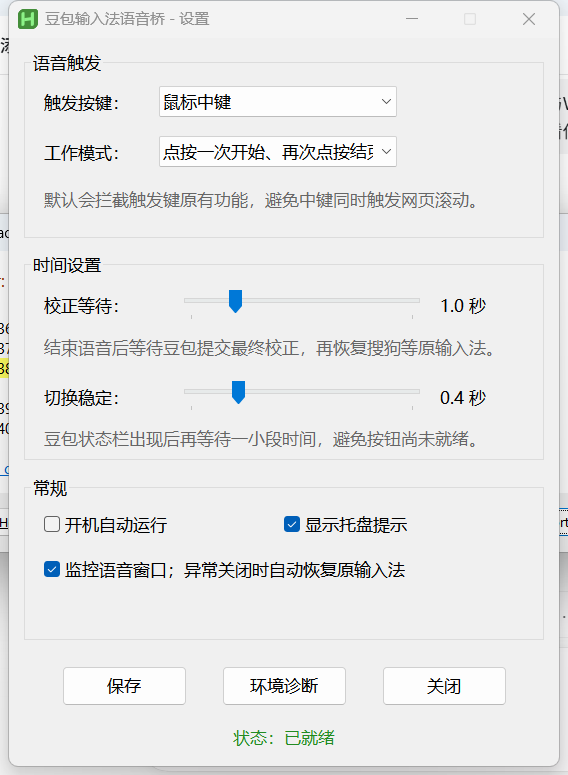

# 豆包输入法语音桥

一个面向 Windows 的开源托盘工具：平时继续使用搜狗等输入法，需要语音时通过一个自定义按键临时切换到豆包输入法并启动语音，结束后自动恢复原输入法。

> 本项目针对的是 **豆包 Windows 输入法**，不是豆包 Windows 客户端；不是豆包或字节跳动官方项目。

[下载最新版](https://github.com/fancy1234/doubao-ime-voice-bridge/releases/latest) · [提交问题](https://github.com/fancy1234/doubao-ime-voice-bridge/issues) · [查看源码](DoubaoVoiceIMEBridge.ahk)



## 为什么做这个工具

豆包输入法的语音识别和语义校正很好用，但日常打字时，很多用户仍希望保留自己长期使用的搜狗等输入法及其词库。本工具把两者组合起来：文字输入继续使用原输入法，语音输入临时调用豆包。

## 功能

- 从搜狗或其他输入法自动切换到豆包输入法。
- 直接触发豆包输入法状态栏的麦克风按钮，不调用豆包客户端。
- 语音结束并等待最终校正后，自动恢复原输入法。
- 支持“两次点按”和“按住说话”两种模式。
- 可选触发键：鼠标中键、两个侧键、右 Ctrl、右 Alt、F8～F12。
- 可调校正等待和输入法切换稳定时间。
- 托盘暂停、环境诊断、开机启动和异常恢复。
- 不使用剪贴板，不保存或上传语音、识别文字及输入法词库。

## 系统要求

- Windows 10 或 Windows 11。
- 已安装并能正常使用豆包 Windows 输入法。
- 豆包输入法状态栏已开启。

工具启动时会检查豆包输入法的安装目录和系统安装记录。`ImeService.exe` 尚未运行不代表没有安装；第一次触发时工具会自动切换并等待豆包服务启动。

## 下载与使用

1. 从 [Releases](https://github.com/fancy1234/doubao-ime-voice-bridge/releases) 下载最新版 EXE。
2. 如果以前运行过其他监听鼠标中键的版本，请先退出旧程序。
3. 运行 `DoubaoVoiceIMEBridge.exe`。
4. 首次运行会打开设置窗口；默认是“鼠标中键 / 两次点按 / 校正等待 1 秒”。
5. 保持搜狗等原输入法，在可以输入文字的位置点按中键开始语音，再点按一次结束。

EXE 为便携版，不写入豆包或搜狗目录。启用“开机自动运行”时，只会在当前用户的启动文件夹创建快捷方式。

当前 EXE 没有商业代码签名证书，Windows SmartScreen 或个别安全软件可能在首次运行时给出提醒。请只从本仓库的 Release 或 README 列出的镜像下载，并核对同版本的 SHA-256；不放心时可以直接检查并运行源码。

## 工作流程

```text
触发按键
  → 检查豆包输入法是否已安装
  → 记录当前输入法切换步数
  → 用 Win+Space 临时切换到豆包输入法
  → 等待 ImeService 和状态栏完成启动
  → 直接触发状态栏麦克风按钮
  → 豆包输入法在当前光标处写入识别文字
  → 结束语音并等待最终校正
  → 用反向切换步数恢复原输入法
```

## 设置说明

- **触发按键**：选择不会与常用软件冲突的鼠标键或键盘键。
- **两次点按**：第一次开始，第二次结束，适合长时间口述。
- **按住说话**：按下开始，松开结束。
- **校正等待**：结束语音后等待豆包提交最终文字，默认 1 秒。
- **切换稳定**：豆包状态栏出现后再等待一段时间，默认 0.4 秒。
- **语音窗口监控**：只有确实检测到语音窗口后，才会根据窗口关闭状态自动恢复。部分豆包版本没有独立波形窗口，这属于正常情况。

配置文件位于：

```text
%APPDATA%\DoubaoVoiceIMEBridge\config.ini
```

删除配置文件即可恢复默认设置，不会影响任何输入法词库。

## 隐私

本工具不联网，不采集音频，不读取或保存识别文字，不读取输入法词库，也不通过剪贴板传递文本。语音采集、识别和文本写入均由豆包输入法自身完成。

## 当前兼容性边界

- 当前根据窗口类 `OimeDirectUIWindow` 识别豆包状态栏。
- 当前根据窗口类 `OimeVoiceWaveWindow` 识别可选的语音窗口。
- 麦克风按钮使用豆包默认状态栏皮肤的客户区坐标 `(55, 19)`。
- 豆包升级后如果更改窗口类或状态栏布局，可能需要更新工具。
- 状态栏关闭、系统输入法列表未包含豆包或切换顺序异常时，自动启动可能失败。
- 当前主要在豆包输入法 `0.8.0.08176` 上验证，公开版本暂标记为 Beta。

## 遇到问题

先打开托盘菜单中的“环境诊断”，然后通过 [Bug 报告](https://github.com/fancy1234/doubao-ime-voice-bridge/issues/new?template=bug_report.yml) 提供：

- 工具版本、Windows 版本和豆包输入法版本。
- 当前触发键与工作模式。
- 问题发生前正在使用的输入法。
- 环境诊断内容。
- 能否手动切换豆包输入法并正常使用语音。

请勿在公开 Issue 中上传密码、个人语音、隐私文本或其他敏感信息。

## 从源码运行和构建

源码需要 AutoHotkey v2。直接运行：

```powershell
& "C:\Program Files\AutoHotkey\v2\AutoHotkey64.exe" ".\DoubaoVoiceIMEBridge.ahk"
```

编译方法见 [BUILD.md](BUILD.md)。

## 参与贡献

欢迎提交兼容性信息、Bug 报告和 Pull Request。修改窗口识别、输入法切换或直接消息调用时，请说明测试过的豆包与 Windows 版本。

## 致谢

[xiaohu31/doubao-voice-helper](https://github.com/xiaohu31/doubao-voice-helper) 提供了“让豆包语音能力更容易被调用”的产品思路参考。该项目面向豆包客户端；本项目面向豆包输入法，核心实现独立完成。

## 许可证

本项目按 [GNU GPL v2](LICENSE) 开源。编译后的 EXE 包含 AutoHotkey 运行时，AutoHotkey 本身同样采用 GPL-2.0 许可证。
